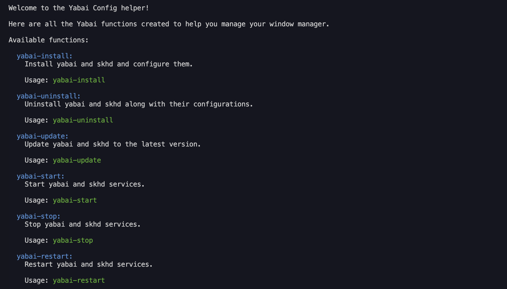

# Yabai-Config

> A simple and clean configuration functions set for yabai.



## Getting Started

### Introduction

This project is a simple and clean configuration functions set for yabai. It is designed to be easy to use. The whole project uses [yabai](https://github.com/koekeishiya/yabai) and [skhd](https://github.com/koekeishiya/skhd) developped by [koekeishiya](https://github.com/koekeishiya).

### Prerequisites

- OS: macOS (version requirements are available in the readme of [yabai](https://github.com/koekeishiya/yabai))
- zsh terminal

### Install

Get into your terminal in your home directory or where you want to install the project (somewhere stable).

To go to your home directory, use the following command:

```sh
cd ~
```

To install the project, download the .zip file from github or use the following command:

```sh
git clone https://github.com/MorganKryze/Yabai-Setup.git
```

Then, go to the project directory:

```sh
cd Yabai-Setup
```

You can add the commands to your shell configuration file (e.g. `~/.zshrc`). To do so, use the following command:

```sh
zsh add-commands.sh
```

> [!IMPORTANT]
> Before getting into the fun part, go to : System Settings > Desktop & Dock > Mission Control and **only check** "Displays have separate Spaces".

Then, follow the steps described in this page to disable some System Integrity Protection (SIP) features: [yabai](https://github.com/koekeishiya/yabai/wiki/Disabling-System-Integrity-Protection).

> [!CAUTION]
> These steps above are not mandatory and can be dangerous but are recommended to use the full potential of yabai.

Now, everything is set up. Start by running the following command:

```sh
yabai-help
```

If you encounter this error message:

```plaintext
zsh: command not found: yabai-help
```

Then redo the following command and restart your terminal (or add manually the path to your .zshrc):

```sh
zsh add-commands.sh
```

Now you may start the installation process by running the following command:

```sh
yabai-install
```

> [!NOTE]
> You will be asked to authorize yabai to access Accessibility features. You can do so by going to System Preferences > Privacy & Security > Accessibility and check the box next to yabai.

Then, you can start yabai by running the following command:

```sh
yabai-start
```

### Usage

Now that you have installed the project, you can use the following commands:

- `yabai-help`: Display the help message.
- `yabai-start`: Start yabai service.
- `yabai-stop`: Stop yabai service.
- `yabai-restart`: Restart yabai.
- `yabai-uninstall`: Uninstall yabai (refer to [this page](https://github.com/koekeishiya/yabai/wiki/Disabling-System-Integrity-Protection) to re-enable system integrity protection)

### Project structure

Here are the most important files and directories of the project( you may ignore the other files and directories):

```plaintext
Yabai-Setup
├── src
│   ├── assets
│   │   ├── img
│   │   │   └── screenshot.png
│   │   ├──.skhdrc.example
│   │   └──.yabairc.example
│   └── yabai-setup.sh
├── .gitignore
├── add-commands.sh
├── SECURITY
├── CODE_OF_CONDUCT
├── CONTRIBUTING
├── LICENCE
└── README.md
```

#### Small descriptives

##### `src/`

This directory contains the source code of the project.

##### `src/assets/`

This directory contains the assets of the project.

##### `.skhdrc.example` and `.yabairc.example`

Default configuration files for skhd and yabai (contains shortcuts and behaviors).

##### `yabai-setup.sh`

The main file of the project. It contains the functions of the project.

##### `add-commands.sh`

A file to add the commands to your shell configuration file (e.g. `~/.zshrc`).

## Supported platforms

- MacOS (yabai is a MacOS only tiling manager)

## Contributing

If you want to contribute to the project, you can follow the steps described in the [CONTRIBUTING](CONTRIBUTING) file.

## License

This project is licensed under the MIT License - see the [LICENSE.md](LICENSE) file for details.
